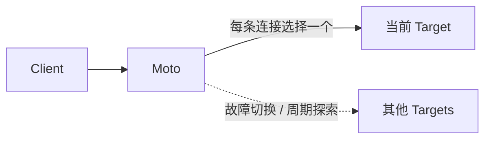

<p align="center">
  
</p>

<h1 align="center">Moto</h1>

<p align="center"><strong>在不断变化的网络里，自动找到更值得走的 TCP 路径。</strong></p>

<p align="center">
  <a href="https://github.com/cppla/moto/actions/workflows/ci.yml"></a>
  <a href="go.mod"></a>
  <a href="LICENSE"></a>
</p>

Moto 是轻量级、自适应的 TCP 网关，也可以把本地 SOCKS5 CONNECT 转换为复用连接的 HTTP/2 或 HTTP/3 CONNECT。应用只连接一个稳定入口，Moto 根据真实连接延迟、近期故障和转发规则，从多个上游、隧道或跨地域节点中动态选路。

## 为什么是 Moto？

- **自适应选路：** 顺序故障切换、首包与 TLS SNI/ALPN 分类、线路质量学习、候选竞速、主动健康检查、故障隔离和恢复探测都在一个进程内完成。
- **协议透明：** 默认 `protocol: "tcp"` 不终止 TLS、不改写流量，也不要求接入 SDK；HTTP(S)、WebSocket、SSH、SOCKS5 和私有 TCP 协议均可直接使用。
- **SOCKS5 CONNECT 桥接：** `protocol: "socks5"` 接收标准 SOCKS5 CONNECT，向支持 CONNECT 的上游代理发送带可选 Basic Auth 的 HTTP/3 或 HTTP/2 请求；H3 不可用时在同一决策期限内回退 H2。
- **高效转发：** 稳定字节流直接交给 `io.Copy`；Linux 上符合条件的 TCP→TCP 路径通常由 Go 运行时自动使用 `splice(2)` 零拷贝，不支持时自动回退。
- **轻而可靠：** 单个 Go 二进制加一份 JSON 即可运行，同时内置严格配置校验、资源上限、访问控制、Prometheus 指标、优雅退出和跨平台发布。

## 30 秒启动

```bash
git clone https://github.com/cppla/moto.git
cd moto

# 校验配置，不监听端口
go run . --config config/setting.json --check-config

# 启动
go run . --config config/setting.json
```

配置路径优先级为 `--config`、`MOTO_CONFIG`、`config/setting.json`。Unix 下发送 `SIGHUP` 会校验并原子切换规则：旧连接继续使用旧规则，新连接只使用新规则；解析、校验或新端口绑定失败时继续运行原配置。最多允许 8 个旧 generation 同时排空，达到上限会拒绝下一次重载；generation 本身会等待全部旧连接结束，但退役时会立即关闭空闲 H2/H3 transport，承载活动 CONNECT 的 transport 也会在自己的最后一条 stream 结束时关闭，不会再被同代的无关长连接钉住。Windows、日志或 metrics 监听变更需要重启。收到 `SIGINT` 或 `SIGTERM` 后，Moto 停止接收新连接，并为现有连接保留最多 10 秒的优雅退出时间。

## 工作方式



## 运行模式

| 模式 | 行为 |
| --- | --- |
| `normal` | 按配置顺序连接目标，直到成功 |
| `regex` | 在最多 4 KiB 的客户端首包中匹配规则，再转发完整字节流 |
| `boost` | 按线路质量竞速候选目标，缓存胜出线路并定期探索；可选延迟备用拨号 |
| `roundrobin` | 按规则独立轮询；单个目标失败时回退到竞速选择 |
| `tls` | 解析 ClientHello 的 SNI/ALPN 选路，再原样转发 TLS 字节流 |

`mode` 只决定如何在 targets 之间选路；监听协议由 `protocol` 独立决定。`normal`、`boost` 和 `roundrobin` 都可用于 SOCKS5 → H2/H3 CONNECT。

<details>
<summary><strong>选路与可靠性</strong></summary>

Moto 综合连接质量、近期结果和主动健康状态选择线路，并自动隔离、恢复异常上游。`boost` 与可选 `hedge` 用于降低连接建立的尾延迟，同时保持有界并发，避免故障放大。

预热仅适用于确认能够安全复用空闲连接的 TCP 上游。Moto 对前台拨号、后台维护和健康探测实施独立资源限制，以在高并发或上游故障时保护进程稳定性。

</details>

<details>
<summary><strong>首包正则示例与限制</strong></summary>

| 协议 | JSON 中的正则表达式 |
| --- | --- |
| HTTP | `^(GET|POST|HEAD|DELETE|PUT|PATCH|CONNECT|OPTIONS|TRACE) ` |
| TLS | `^\\x16\\x03` |
| RDP | `^\\x03\\x00\\x00` |
| SOCKS5 | `^\\x05` |

TCP 是字节流，不保证一次读取就是完整数据包。Moto 会增量读取并在任一规则匹配后停止分类。`regex` 只适合客户端先发送数据的协议；常见 SSH 客户端会等待服务端 banner，VNC、FTP、MySQL 也是服务端先握手，这些协议应使用 `normal`、`boost` 或 `roundrobin` 直接转发。

</details>

## 配置

```json
{
  "log": {
    "level": "info",
    "path": ""
  },
  "metrics": {
    "enabled": true,
    "listen": "127.0.0.1:9090"
  },
  "rules": [
    {
      "name": "web",
      "listen": "127.0.0.1:8080",
      "mode": "boost",
      "prewarm": false,
      "timeout": 3000,
      "hedge": {
        "minDelay": 25,
        "maxDelay": 250
      },
      "allowlist": ["127.0.0.0/8", "::1/128"],
      "targets": [
        { "address": "server-a.example.com:443" },
        { "address": "server-b.example.com:443" }
      ]
    }
  ]
}
```

| 字段 | 默认值 | 说明 |
| --- | --- | --- |
| `mode` | 无 | `normal`、`regex`、`boost`、`roundrobin` 或 `tls` |
| `protocol` | `tcp` | `tcp` 为透明字节流；`socks5` 解析入站 CONNECT 并使用 target 的 `connectProxy` |
| `timeout` | `regex` 为 500 ms；其余为 3 s | 拨号或首包决策期限，不限制已建立连接的寿命 |
| `prewarm` | `false` | 仅在上游允许业务握手前保持空闲 TCP 时启用 |
| `hedge` | 关闭 | 仅用于至少两个唯一目标的 `boost`；空对象默认延迟范围 25–250 ms，且 `maxDelay` 必须小于规则 `timeout` |
| `healthCheck` | 关闭 | 可选 TCP 或明文 HTTP 主动探测，达到阈值后暂时排除目标 |
| `proxyProtocol` | 关闭 | 从可信 CIDR 接收 PROXY v1/v2，或向上游发送 v1/v2 |
| `userAgent` | 缺省 | 仅用于 `socks5` 规则；从非空数组中为每次入站 SOCKS5 CONNECT 随机选择一个上游 HTTP CONNECT User-Agent |
| `allowlist` | 空 | CIDR 来源白名单；空值允许所有有效地址 |
| `blacklist` | 空 | 兼容旧配置的精确 IP 拒绝表 |
| `maxConnections` | `4096` | 单规则连接上限 |
| `maxConnectionsPerIP` | `256` | 单 IP、单规则连接上限 |
| `metrics` | 关闭 | 启用时默认监听 `127.0.0.1:9090` |

### SOCKS5 → HTTP/3/HTTP/2 CONNECT

SOCKS5 到 H3/H2 CONNECT 的完整规则已经整合到 [config/setting.json](config/setting.json)。部署前请替换每个 target 中的上游代理用户名和密码：

```json
{
  "name": "智能加速（SOCKS5 → H3/H2 CONNECT）",
  "listen": "127.0.0.1:9005",
  "mode": "boost",
  "protocol": "socks5",
  "prewarm": false,
  "timeout": 3000,
  "hedge": { "minDelay": 25, "maxDelay": 250 },
  "healthCheck": { "type": "tcp", "interval": 10000, "timeout": 2000 },
  "allowlist": ["127.0.0.0/8", "::1/128"],
  "userAgent": [
    "Mozilla/5.0 (Macintosh; Intel Mac OS X 10_15_7) AppleWebKit/537.36 (KHTML, like Gecko) Chrome/151.0.0.0 Safari/537.36",
    "Mozilla/5.0 (Macintosh; Intel Mac OS X 10.15; rv:154.0) Gecko/20100101 Firefox/154.0"
  ],
  "targets": [
    {
      "address": "proxy-a.example.com:443",
      "connectProxy": {
        "protocols": ["h3", "h2"],
        "serverName": "proxy-a.example.com",
        "basicAuth": {
          "username": "YOUR_PROXY_USER",
          "password": "YOUR_PROXY_PASSWORD"
        }
      }
    },
    {
      "address": "proxy-b.example.com:443",
      "connectProxy": {
        "protocols": ["h3", "h2"],
        "serverName": "proxy-b.example.com",
        "basicAuth": {
          "username": "YOUR_PROXY_USER",
          "password": "YOUR_PROXY_PASSWORD"
        }
      }
    }
  ]
}
```

`protocols` 按配置顺序尝试。Moto 支持 H3/H2 连接复用、自动故障切换、恢复探测和自适应选路；这些策略由程序内部管理，无需额外调节。Moto 始终校验证书与 `serverName`，上游拒绝也不会被误报为 SOCKS 成功。

`userAgent` 只设置上游 CONNECT 请求头，不代表浏览器 TLS 或 QUIC 指纹。任何支持 SOCKS5 CONNECT 的客户端都可以连接 `127.0.0.1:9005`；当前仅支持 TCP CONNECT。对外监听时必须使用防火墙、VPN 和 `allowlist` 限制来源。

SOCKS5 模式使用独立的协议连接管理，因此必须保持 `prewarm: false`，也不能与 `regex`、`tls`、HTTP health check 或 PROXY protocol 组合。Basic Auth 凭据存放在 JSON 中，应严格限制配置文件权限。Moto 会在启动前校验配置，无效配置不会投入运行。

<details>
<summary><strong>TLS、健康检查与 PROXY protocol 示例</strong></summary>

```json
{
  "name": "tls-edge",
  "listen": "127.0.0.1:8443",
  "mode": "tls",
  "timeout": 3000,
  "healthCheck": {
    "type": "tcp",
    "interval": 10000,
    "timeout": 2000,
    "failureThreshold": 3,
    "successThreshold": 2
  },
  "proxyProtocol": {
    "accept": true,
    "trustedCIDRs": ["127.0.0.0/8"],
    "send": "v2"
  },
  "targets": [
    {
      "address": "127.0.0.1:9443",
      "serverNames": ["api.example.com", "*.edge.example.com"],
      "alpn": ["h2", "http/1.1"]
    },
    { "address": "127.0.0.1:9444" }
  ]
}
```

`tls` 不解密流量；`serverNames` 支持精确名称和单标签 `*.` 通配符，`alpn` 为精确匹配，未配置匹配条件的目标是 fallback。

`healthCheck` 的时长单位均为毫秒：`interval` 默认 10 秒、范围 250 毫秒到 10 分钟；`timeout` 默认取 2 秒与 interval 的较小值、范围 50 毫秒到 30 秒且不得超过 interval；失败/恢复阈值默认 3/2，范围均为 1–20。HTTP 检查的 `path` 默认 `/`、只接受最长 2 KiB 的 origin-form，状态码默认接受 200–399，可配置在 100–599 内；不跟随重定向。单份配置最多启用 1,024 个 rule-target 检查任务，进程同时探测不超过 32 个目标。

`trustedCIDRs` 只校验直连 Moto 的上一跳；`proxyProtocol.accept: true` 要求可信上一跳的每条连接都以完整、合法的 PROXY v1/v2 头开始，非可信来源、缺失或畸形头都会被拒绝。`send` 可为 `v1` 或 `v2`；启用 outbound PROXY 时不能同时启用 `prewarm`，因为建池时还不知道客户端地址。

</details>

## 安全与可观测

- 示例配置只监听 `127.0.0.1` 并关闭预热，但各模式已启用 TCP 健康检查；启动后仍会周期连接配置的外部目标，部署前必须替换为自己的上游。
- 进程最多同时处理 4,096 条客户端连接；若监听公网地址，应同时配置精确 `allowlist`，并使用防火墙或安全组限制来源。
- 默认 TCP 规则是透明转发器；SOCKS5 bridge 会解析握手并终止到上游 proxy 的 TLS/QUIC，但不解密隧道内的最终 TLS。两种模式都不替代应用认证或网络访问控制；观测端点只能监听数字形式的 loopback 地址。

```bash
curl -fsS http://127.0.0.1:9090/healthz
curl -fsS http://127.0.0.1:9090/readyz
curl -fsS http://127.0.0.1:9090/metrics
```

`healthz` 表示进程可响应，`readyz` 表示服务已准备接收流量。Prometheus 指标覆盖进程资源、连接、流量、路由健康和 CONNECT 运行状态，并限制标签范围，避免暴露客户端请求信息。

## WebSocket

Moto 在 TCP 层透明支持 `ws://` 和 `wss://`。HTTP Upgrade、TLS 握手和 WebSocket 帧不会被改写，已建立会话也不受规则 `timeout` 限制；通用四种模式均有 Upgrade、文本帧、Ping/Pong 和长连接端到端测试，`tls` 模式另有真实 ClientHello 分片与原字节重放测试。

上述零拷贝和透明 WebSocket 说明针对 `protocol: "tcp"`。SOCKS5 → H2/H3 需要 TLS/QUIC 加密和 HTTP DATA framing，不能使用 TCP→TCP 的 `splice(2)` 零拷贝路径。

长连接会持续占用连接额度，并在 Moto 关闭超过 10 秒后被强制断开。`regex` 只能检查明文 WS 握手前 4 KiB；WSS 的 Host 和路径已加密，但 `tls` 模式可按 SNI/ALPN 分流。WebSocket 规则建议保持 `prewarm: false`。

## 构建与验证

项目要求 Go 1.25.13 或更高的兼容版本。

```bash
# 完整本地门禁
make check

# 与 CI 等价，并交叉构建 Linux、macOS 和 Windows
make ci

# 生成带版本信息的当前平台二进制
make build
./bin/moto --version
```

<details>
<summary><strong>Docker 与 systemd</strong></summary>

Docker 镜像默认以非 root `65532:65532` 运行，包含系统 CA bundle，并从 `/etc/moto/setting.json` 读取挂载的配置。含 Basic Auth 的配置不要直接用工作区里通常为 `0644` 的文件；Linux 上先建立仅 root 与容器运行组可读的独立副本。当前示例监听 `9001`–`9005`，无需低端口绑定权限：

```bash
sudo install -d -o root -g 65532 -m 0750 /etc/moto-container
sudo install -o root -g 65532 -m 0640 \
  config/setting.json /etc/moto-container/setting.json
# 用 sudoedit 替换 Basic Auth
sudoedit /etc/moto-container/setting.json
docker build -t moto:local .
docker run --rm --network host \
  --user 65532:65532 \
  --security-opt no-new-privileges:true \
  -v /etc/moto-container/setting.json:/etc/moto/setting.json:ro \
  moto:local
```

systemd unit 使用专用 `moto` 用户、只读系统目录和最小网络能力，`systemctl reload moto` 会发送 `SIGHUP`：

```bash
make build
getent group moto >/dev/null || sudo groupadd --system moto
id -u moto >/dev/null 2>&1 || sudo useradd --system --gid moto --home-dir /var/lib/moto --shell /usr/sbin/nologin moto
sudo install -m 0755 bin/moto /usr/local/bin/moto
sudo install -d -o root -g moto -m 0750 /etc/moto
sudo install -o root -g moto -m 0640 config/setting.json /etc/moto/setting.json
sudo install -m 0644 packaging/moto.service /etc/systemd/system/moto.service
sudo systemctl daemon-reload
sudo systemctl enable --now moto
```

</details>

CI 覆盖格式、模块完整性、测试、race、vet、staticcheck、可达漏洞、示例配置、真实 TLS H2/H3 CONNECT、Basic Auth、SOCKS5 回复时序、TLS/PROXY/热重载端到端测试和四种通用模式的本机闭环 smoke。推送 `v*` tag 会先通过完整门禁，再生成可复现的多平台压缩包、CycloneDX SBOM、SHA-256 校验文件和自动 release notes；归档内含二进制、README、LICENSE、示例配置和 systemd unit。

<details>
<summary><strong>本地回归与性能采样</strong></summary>

完全本地的回归门禁不访问外网，会报告直连、启动初期（输出中保留名称 `cold`，但同一阶段后续请求会逐渐变热）和热态的成功吞吐与 p50/p95/p99，并采样 CPU、RSS、FD 和 goroutine。这是功能与回归 smoke，不是绝对容量结论：

```bash
python3 test/bench.py --self-contained --mode boost \
  --concurrency 50 --total 500 --warmup 50 \
  --min-success-rate 99 --save /tmp/moto-bench.json
```

大流量双向转发另有逐字节校验的直连/代理同负载基准；它会同时采样 CPU、RSS、FD，并可在 Linux 网络命名空间中加入延迟、抖动、丢包和带宽限制：

```bash
python3 test/bulk_relay_bench.py --direction both \
  --concurrency 4 --connections 8 \
  --bytes-per-direction 256MiB \
  --min-success-rate 100 --save /tmp/moto-bulk.json
```

正式 A/B 应至少重复 5 轮，在相同预热条件下交替默认顺序与 `--proxy-first`，报告中位数、离散程度和全部原始结果。自包含 fixture 与负载生成器共享 Python 进程，适合回归和相对对比；绝对容量测试应把客户端、Moto 和上游分离并绑定 CPU。

Linux 的 `splice` 每个转发方向会占用一根内核 pipe，因此一条双向连接除客户端、上游 socket 外还需要 4 个 pipe FD。按进程 4,096 条连接上限部署时，建议 `LimitNOFILE`/`ulimit -n` 至少为 65,536；随仓库提供的 systemd unit 已配置更高上限。高并发大流量测试应同时观察 FD、RSS 和内核 pipe 内存，而不只看吞吐。

SOCKS5 外部场景也可参数化运行：

```bash
python3 test/bench.py \
  --proxy-host 127.0.0.1 --proxy-port 9004 \
  --target-host www.baidu.com --target-port 80 \
  --concurrency 50 --total 500 \
  --min-success-rate 99
```

生产性能评估应同时记录直连基线、成功率、p50/p95/p99 和资源峰值，不能只比较单次最快延迟。

跨地域且有丢包的 Linux 链路可单独 A/B 测试 BBR 等拥塞控制算法，但它们是宿主机或网络命名空间级的全局策略。Moto 不会在进程内加载内核模块或修改 `sysctl`；上线前应使用与业务方向、RTT、丢包率和带宽相同的可回滚测试验证收益。

</details>

## 参考

- [better way for tcp relay](https://hostloc.com/thread-969397-1-1.html)
- [switcher](https://github.com/crabkun/switcher)
