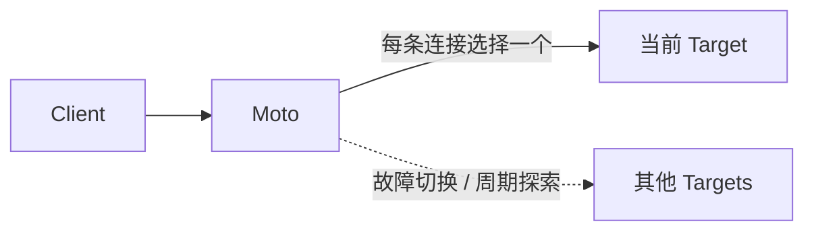

<p align="center">
  
</p>

<h1 align="center">Moto</h1>

<p align="center"><strong>在不断变化的网络里，自动找到更值得走的 TCP 路径。</strong></p>

<p align="center">
  <a href="https://github.com/cppla/moto/actions/workflows/ci.yml"></a>
  <a href="go.mod"></a>
  <a href="LICENSE"></a>
</p>

Moto 是轻量级、自适应的 TCP 网关。应用只连接一个稳定入口，Moto 根据真实拨号延迟、近期故障和转发规则，从多个上游、隧道或跨地域节点中动态选路。

## 为什么是 Moto？

- **自适应选路：** 顺序故障切换、首包分类、EWMA 延迟学习、Top-2 竞速、轮询、熔断和恢复探测都在一个进程内完成。
- **协议透明：** 不终止 TLS、不改写流量，也不要求接入 SDK；HTTP(S)、WebSocket、SSH、SOCKS5 和私有 TCP 协议均可直接使用。
- **轻而可靠：** 单个 Go 二进制加一份 JSON 即可运行，同时内置严格配置校验、资源上限、访问控制、Prometheus 指标、优雅退出和跨平台发布。

## 30 秒启动

```bash
git clone https://github.com/cppla/moto.git
cd moto

# 校验配置，不监听端口
go run . --config config/setting.json --check-config

# 启动
go run . --config config/setting.json
```

配置路径优先级为 `--config`、`MOTO_CONFIG`、`config/setting.json`。收到 `SIGINT` 或 `SIGTERM` 后，Moto 停止接收新连接，并为现有连接保留最多 10 秒的优雅退出时间。

## 工作方式



## 运行模式

| 模式 | 行为 |
| --- | --- |
| `normal` | 按配置顺序连接目标，直到成功 |
| `regex` | 在最多 4 KiB 的客户端首包中匹配规则，再转发完整字节流 |
| `boost` | 按 EWMA 评分竞速 Top-2 目标，缓存胜出线路并定期探索其他线路 |
| `roundrobin` | 按规则独立轮询；单个目标失败时回退到竞速选择 |

<details>
<summary><strong>选路、熔断与预热细节</strong></summary>

域名由 Go TCP Dialer 处理，并支持 IPv4/IPv6 快速回退。每条线路记录拨号延迟 EWMA；连续三次拨号失败或可明确归因于上游的转发失败后，线路进入 5 秒熔断冷却，重复失败时最长增加到 60 秒。冷却结束只允许一个半开探针，竞速取消的败者不会被误记为故障。

预热池默认关闭。启用后，每个目标最多 4 个并发补充拨号、进程最多 32 个、单份配置最多 256 个唯一预热目标。Unix 会用非消费式 `MSG_PEEK` 拒绝已收到 FIN/RST 的空闲连接；无法安全探测的平台使用新连接。线路熔断时旧池会被清空并暂停补充。

</details>

<details>
<summary><strong>首包正则示例与限制</strong></summary>

| 协议 | JSON 中的正则表达式 |
| --- | --- |
| HTTP | `^(GET|POST|HEAD|DELETE|PUT|CONNECT|OPTIONS|TRACE)` |
| SSH | `^SSH` |
| TLS | `^\\x16\\x03` |
| RDP | `^\\x03\\x00\\x00` |
| SOCKS5 | `^\\x05` |

TCP 是字节流，不保证一次读取就是完整数据包。Moto 会增量读取并在任一规则匹配后停止分类。`regex` 只适合客户端先发送数据的协议；VNC、FTP、MySQL 等服务端先握手协议不能依靠客户端首包区分。

</details>

## 配置

```json
{
  "log": {
    "level": "info",
    "path": ""
  },
  "metrics": {
    "enabled": true,
    "listen": "127.0.0.1:9090"
  },
  "rules": [
    {
      "name": "web",
      "listen": "127.0.0.1:8080",
      "mode": "boost",
      "prewarm": false,
      "timeout": 3000,
      "allowlist": ["127.0.0.0/8", "::1/128"],
      "targets": [
        { "address": "server-a.example.com:443" },
        { "address": "server-b.example.com:443" }
      ]
    }
  ]
}
```

| 字段 | 默认值 | 说明 |
| --- | --- | --- |
| `mode` | 无 | `normal`、`regex`、`boost` 或 `roundrobin` |
| `timeout` | `regex` 为 500 ms；其余为 3 s | 拨号或首包决策期限，不限制已建立连接的寿命 |
| `prewarm` | `false` | 仅在上游允许业务握手前保持空闲 TCP 时启用 |
| `allowlist` | 空 | CIDR 来源白名单；空值允许所有有效地址 |
| `blacklist` | 空 | 兼容旧配置的精确 IP 拒绝表 |
| `maxConnections` | `4096` | 单规则连接上限 |
| `maxConnectionsPerIP` | `256` | 单 IP、单规则连接上限 |
| `metrics` | 关闭 | 启用时默认监听 `127.0.0.1:9090` |

配置采用严格校验：未知字段、未知模式、重复规则名或监听地址、非法 CIDR、空目标和非法正则都会阻止启动。所有监听地址会先一次性绑定，任一端口失败都不会留下部分服务继续运行。

## 安全与可观测

- 示例配置只监听 `127.0.0.1`，默认关闭预热，启动时不会主动连接外部目标。
- 进程最多同时处理 4,096 条客户端连接；若监听公网地址，应同时配置精确 `allowlist`，并使用防火墙或安全组限制来源。
- Moto 是透明 TCP 转发器，不替代 TLS、应用认证或网络访问控制；观测端点只能监听数字形式的 loopback 地址。

```bash
curl -fsS http://127.0.0.1:9090/healthz
curl -fsS http://127.0.0.1:9090/readyz
curl -fsS http://127.0.0.1:9090/metrics
```

`healthz` 表示进程可响应，`readyz` 只在全部转发监听器就绪且未进入关闭流程时成功。Prometheus 指标覆盖 goroutine、连接数、转发字节与错误、拨号成功率与耗时、Boost 缓存、线路 EWMA/熔断状态和预热池状态。

## WebSocket

Moto 在 TCP 层透明支持 `ws://` 和 `wss://`。HTTP Upgrade、TLS 握手和 WebSocket 帧不会被解析或改写，已建立会话也不受规则 `timeout` 限制；四种模式均有 Upgrade、文本帧、Ping/Pong 和长连接端到端测试。

长连接会持续占用连接额度，并在 Moto 关闭超过 10 秒后被强制断开。`regex` 只能检查明文 WS 握手前 4 KiB；WSS 中的 Host 和路径已被 TLS 加密，无法用于正则分流。WebSocket 规则建议保持 `prewarm: false`。

## 构建与验证

项目要求 Go 1.25.13 或更高的兼容版本。

```bash
# 完整本地门禁
make check

# 与 CI 等价，并交叉构建 Linux、macOS 和 Windows
make ci

# 生成带版本信息的当前平台二进制
make build
./bin/moto --version
```

CI 覆盖格式、模块完整性、测试、race、vet、staticcheck、可达漏洞、示例配置和四模式本机闭环 smoke。推送 `v*` 语义版本 tag 会生成可复现的多平台压缩包、CycloneDX SBOM、SHA-256 校验文件和自动 release notes。

<details>
<summary><strong>本地回归与性能采样</strong></summary>

完全本地的回归门禁不访问外网，会报告直连、冷态和热态的吞吐与 p50/p95/p99，并采样 CPU、RSS、FD 和 goroutine：

```bash
python3 test/bench.py --self-contained --mode boost \
  --concurrency 50 --total 500 --warmup 50 \
  --min-success-rate 99 --save /tmp/moto-bench.json
```

SOCKS5 外部场景也可参数化运行：

```bash
python3 test/bench.py \
  --proxy-host 127.0.0.1 --proxy-port 84 \
  --target-host www.baidu.com --target-port 80 \
  --concurrency 50 --total 500 \
  --min-success-rate 99
```

生产性能评估应同时记录直连基线、成功率、p50/p95/p99 和资源峰值，不能只比较单次最快延迟。

</details>

## 参考

- [better way for tcp relay](https://hostloc.com/thread-969397-1-1.html)
- [switcher](https://github.com/crabkun/switcher)
